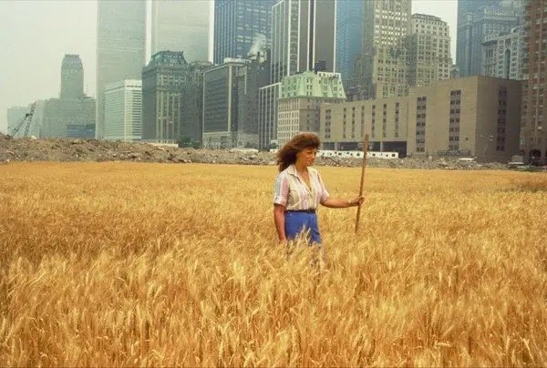
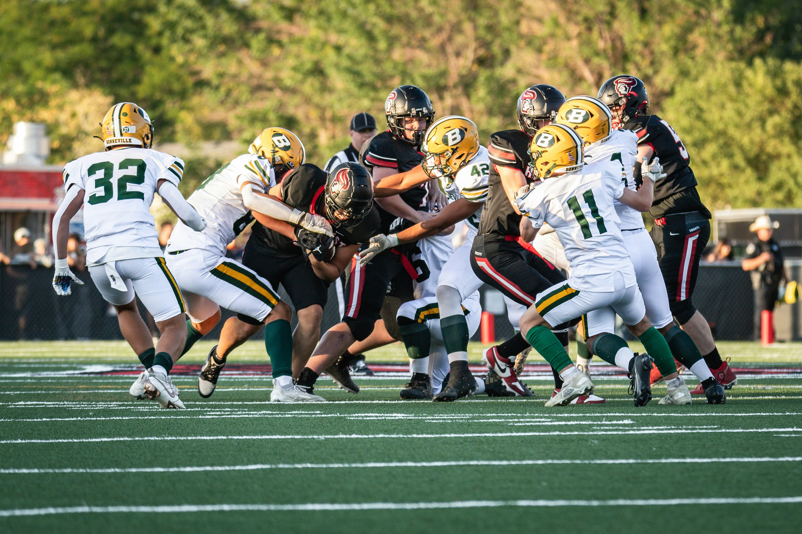

# Sample Inputs and Outputs 
## Quality Control Module Explanation:
The quality control module consists of two phases: the first is feeding a multimodal the input image and making it generate keywords (labeled as 1. in the output), and the second is feeding these keywords plus the worker's transcription to an LLM, then that LLM decides if that fits the quality control standards (`YES/NO` depending on if it contains 2 out of the 10 keywords, but the exact number of keywords is subject to change later) (labeled as 2. in the output). The voice recording also has to contain 80 words at minimum after transcription.

## Aggregation Module Explanation:
The aggregation module takes in n transcriptions and outputs a summarized dense caption.

## Sample I/O:
Sample input:

Sample QC output:

Sample aggregation output:

---
Sample input:

Sample QC output:
1. Keywords: Wheat, Woman, Stick, Blouse, Blue, Skyscrapers, Skirt, Buildings, Manhattan, Field
2. Given a transcription of "We can see a woman standing in the middle of a golden wheat field, holding a tall wooden stick, surrounded by the vibrant stalks of grain. She is wearing a blue skirt and a white blouse. Towering skyscrapers appear behind her, creating a contrast between the natural, rural landscape of the field and the industrial, urban skyline. The scene feels surreal, as if a slice of farmland has been transplanted into the heart of a bustling city, merging two worlds that are rarely seen together so closely.", it contains contain 8 out of 10 keywords and 87 total words, so the model would output `YES` and therefore pass the quality control test.

Sample aggregation output:

---
Sample input:

Sample QC output:

Sample aggregation output:

---
Sample input:

Sample QC output:

Sample aggregation output:

---
