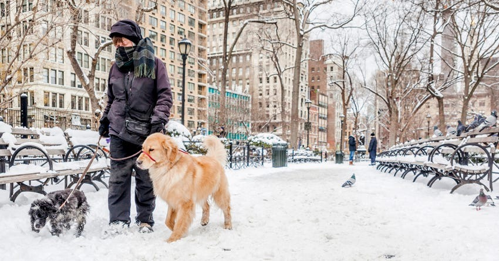

# Sample Inputs and Outputs 
## Quality Control Module Explanation:
The quality control module consists of two phases: the first is feeding a multimodal the input image and making it generate keywords (labeled as 1. in the output), and the second is feeding these keywords plus the worker's transcription to an LLM, then that LLM decides if that fits the quality control standards (`YES/NO` depending on if it contains 2 out of the 10 keywords, but the exact number of keywords is subject to change later) (labeled as 2. in the output). The voice recording also has to contain 80 words at minimum after transcription.

## Aggregation Module Explanation:
The aggregation module takes in 3 transcriptions and outputs a summarized dense caption.

## Sample I/O:
**Sample input:**

*Transcription 1:* "There is a man walking two dogs in a city park and it appears to be the middle of winter. One of the dogs is a small and black. The other one is a golden retriever. The person is wearing a grey hat and a scarf around. There knows a black coat, gloves and what appears to be snow pants. The city in the background is very consists of 10 buildings and there are park benches on the right side of the walkway. The ground is covered in snow and there is a pigeon standing in the middle of the walkway. The trees, there are trees in the background which all don't have leaves."

*Transcription 2:* "A man is walking down a snowy path in a city. He is walking his two dogs. One of them is small and has a black coat, and the other one is larger and has a golden coat. It may be some sort of golden retriever. There is a pigeon also in the middle of the path, and there is another pigeon on the side near the benches. Along the path are a lot of benches that are all covered with snow. In the background there are trees and buildings, and two other people, along with some trash cans and lamp posts. The person is wearing a scarf, a hat, and a coat, and their feet are covered with snow. There are tall buildings in the background."

*Transcription 3:* "And this image we can see why the street in what seems like to be a major city. There are about two inches of snow. We can see in the foreground a person wearing a scarf and walking two dogs, one of which is a bulletproof fever and a slug is in the other dog which is black and gay. There are two pigeons in the background and there seem to be two people for the living background. There are a lot of buildings in the photo, one of which is, has green color to it and the rest of the buildings seem to be beige and brown. There are a lot of trees but none of them have leaves. The weather seems to be overcast in that photo. There seems to be two flash bins and a bunch of benches with snow on them. There are two street lights that seem to be of all style in the photo."

**Sample QC output:**
1. Keywords: `Snow, Bench, Person, Scarf, Dog, Leash, Buildings, Trees, Pigeons, Park`
   
2.a. Transcription 1 contains 6 out of 10 keywords (and 114 total words), so the model would output <`YES`> and therefore <`PASS`> the quality control test.

2.b. Transcription 2 contains 5 out of 10 keywords (and 127 total words), so the model would output <`YES`> and therefore <`PASS`> the quality control test.

2.c. Transcription 3 contains 7 out of 10 keywords (and 160 total words), so the model would output <`YES`> and therefore <`PASS`> the quality control test.

**Sample aggregation output:**
"A man is walking his two dogs through the snowy city park in the middle of winter. One of the dogs is a small, black dog, while the other is a golden retriever. The person is dressed warmly, wearing a grey hat, a scarf, a black coat, gloves, and snow pants. A pigeon stands out in the middle of the walkway, and park benches along the right side are buried under a layer of snow. The city's backdrop features 10 beige and brown buildings, with a green-toned building among them. The tall trees, bare of leaves, loom behind the scene, along with a couple of people in the background, near the lamp posts, trash cans, and streetlights."

---
**Sample input:**

*Transcription 1:* "There is a woman standing in the middle of a field in front of a back scape of a city. It appears to be wheat. The color of the wheat is golden. The woman is holding a stick standing in the statue like a position. She is wearing a blouse with vertical stripes and a blue pair of bottoms. She has frizzy hair and she is looking to the right. The city in the background is very gray and there are many tall buildings all rectangular shaped. She is holding a staff which is a straight staff."

*Transcription 2:* "This photo seems to be some woman on some sort of wheat or hay field. It's a beige or yellow color. The field dominates the foreground and the mid-ground and the woman seems to be in the foreground. She seems to be wearing a pink and white striped color shirt with blue pants. She seems to be holding a long stick in her left hand. She seems to be a white woman with brown hair. In the background there is a city. It seems to be blurred into the fog. There's some construction in the very far background. In the mid-ground there's some more visible construction. They seem to be building new buildings. City seems to be New York-esque, very foggy. It seems unusual that the woman is in the foreground with all this hay with this city background."

*Transcription 3:* "In this photo, we can see a woman in a wheat field. She is wearing a blue skirt and a white, coloured t-shirt that has coloured stripes. We can see her carrying a stick that seems like a wheat harvesting pool in her left hand and standing in a firm pose. She is looking at the wheat field as if she is determined to either harvest or protect the field. In the background, we can see a bunch of buildings in what scenes the women had in New York. The photo seems to be old given the quality of the photo. And the other doesn't seem to be sunny, it seems like it's cloudy and kind of ominous. We can see a bunch of digging happening in the background once used to be a construction site. And we can see the buildings varying in sizes and shapes. Some of the buildings seem to be blue, some of the buildings seem to be white, and we can see what seemed to be the twin towers in the background."

**Sample QC output:**
1. Keywords: `Wheat, Woman, Stick, Blouse, Blue, Skyscrapers, Skirt, Buildings, Manhattan, Field`

2.a. Transcription 1 contains 7 out of 10 keywords (and 97 total words), so the model would output `YES` and therefore pass the quality control test.
  
2.b. Transcription 2 contains 7 out of 10 keywords (and 139 total words), so the model would output `YES` and therefore pass the quality control test.
  
2.c. Transcription 3 contains 7 out of 10 keywords (and 177 total words), so the model would output `YES` and therefore pass the quality control test.

**Sample aggregation output:**

"A woman stands tall in the center of a golden wheat field, her figure evoking a sense of stillness. Behind her, the wheat stretches out as far as the eye can see. She wears a blouse with vertical stripes, paired with a blue pair of pants, and her frizzy hair falls in loose waves around her face. Her gaze is fixed on the right as she holds a straight staff in her hand. In the background, a gray and foreboding cityscape rises, its rectangular and varying-sized buildings looming above the fog. The contrast between the natural and urban environments is striking, with the woman's rustic attire and the staff she holds suggesting a deep connection to the land. Yet, the city's encroaching presence, marked by the sounds of construction in the distance, serves as a reminder that this balance is tenuous at best. The overall atmosphere is one of unease and foreboding, with the cloudy skies and muted color palette adding to the sense of tension. Despite the ominous tone, the woman's determined expression and the quiet dignity with which she stands suggests a sense of resilience in the face of change. Her presence serves as a poignant reminder of the fragility of the natural world and the importance of preserving it in the face of urban progress."

---
**Sample input:**

*Transcription 1:*There are two teams that are in the middle of a tackle. One of the teams is wearing white with yellow helmets with a B on the side of their helmets. The other team is black with red accents. It appears that the black team is running the ball while the white team is trying to tackle them. There are four black players, one of which is running the ball. Three others are trying to push the white players off and there are six white players attempting to tackle the black player who is running the ball. The black player is holding the ball in his left hand and they appear to be around center field. It is a sunny day and the turf is grass. The runner running back appears to have Jordan Brand gloves and the visible numbers for the two white players who are how they're back facing the camera on R32 and 11.

*Transcription 2:*  This image is a very high quality resolution image of what seems to be a football game between two teams. There's one team has white jerseys with green numbers and they also have white pants with green and yellow stripes. This team has yellow helmets with a logo that looks like a B in white. The other team is dressed mostly in black with their pants having red and white stripes. This seems to be a not an NFL football game as the logos don't seem to match. It seems to be either a high school or a college game. This football game is taking place on a turf as evidenced by the green floor. There doesn't seem to be bleachers but there seems to be crowd at the gate. In the far back around there's a security guard who are in cowboy hat and this is taking place during the day.

*Transcription 3:*  Many players are currently involved in a football play. One person is holding the ball. They are wearing a black jersey with red stripes, and their helmet is gray. They are carrying the ball into a group of players wearing white that are trying to stop him from moving any further. The players wearing white also have yellow stripes on their pants and are wearing green socks. Their uniform is mainly white and green, and their helmet is yellow. In the background, there are trees, and it looks like they are playing on a turf ground. It also looks like there are five white players on the white team, and four players on the black team currently in the image, and the referee is standing behind them with his head sticking out. There is an audience watching in the background, but they are out of focus.

**Sample QC output:**
1. Keywords: Football, Tackle, High School,Defense, Players, Uniforms, Action, Field, Teamwork, Competition
   
2.a. Transcription 1 contains 8 out of 10 keywords (and 154 total words), so the model would output <`YES`> and therefore <`PASS`> the quality control test.

2.b. Transcription 2 contains 9 out of 10 keywords (and 161 total words), so the model would output <`YES`> and therefore <`PASS`> the quality control test.

2.c. Transcription 3 contains 8 out of 10 keywords (and 169 total words), so the model would output <`YES`> and therefore <`PASS`> the quality control test.

**Sample aggregation output:**
There are two teams in the middle of a tackle, with the Black and Red team, primarily dressed in black jerseys with red accents on their pants featuring red and white stripes, attempting to advance the ball. Their gray helmets are adorned with no visible logo. Their opponents, the White team, are clad in white jerseys with green numbers, paired with white pants featuring green and yellow stripes, and yellow helmets with a white logo resembling a letter B on the side. It appears that the Black and Red team is running with the ball, with six White team players trying to tackle them. Four Black and Red team players are attempting to push off their White team counterparts. The runner is holding the ball in his left hand and seems to be around the 50-yard line area. He is wearing Jordan Brand gloves. The visible numbers for the White team players with their backs to the camera are R32 and 11. The game is being played on a sunny day, with the turf field covered in grass. There is a security guard wearing a cowboy hat standing near the gate, which is in close proximity to the tree line. The referee is positioned behind the players, and there is a crowd gathered near the gate, watching the game.
---
**Sample input:**

*Transcription 1:* A woman is tending to flowers. She has a flower shop. Her flower shop has a a lot of different varieties of flowers, including pink flowers, red flowers, and yellow flowers. Some of these flowers may be tulips and others may be roses. She is leading over and she is wearing a blue towel on her neck with an apron in the front. She is also wearing pink gloves. On top of her shop, the roof has a bunch of fans and some vets. And she has a lot of light bulbs hanging from the roof for lighting the shop. In the background, there are some boxes and she is currently unloading a box into the display. The flowers are in buckets.

*Transcription 2:* In this photo, we can see a flower shop. There is an almond taking care of the flowers, and she seems to be wearing a mask at all on her neck. I know I T-shirt. She is also wearing cringloves for the foolishness that she's getting to take care of the flowers. There seem to be flowers of all different color-shorts and types, including red flowers, blue flowers, green plants and yellow flowers. There seem to be air conditioning units on top of the shop, namely we can see five fans producing this. We can also see Chinese clip-treatment on one of the signs. The sign seems to be white and split as in red. There we can see at least five different sources of light of different shapes and sizes. We can also see some questions in the background. We can see the urban mind in that photo. There is also a small shop in the background, which seems to be a food stall that has a few chairs and a table.

*Transcription 3:* This is a very beautiful image of a shopkeeper taking care of what seems to be a flower shop. There is many different vibrant pieces of floral flowers. The shopkeeper seems to be cutting some stems of roses and there's various different types of flowers from pink flowers to blue flowers to yellow flowers to green flowers. This picture is probably taking place in a city as evidenced by the many fans at the top of the image and the industrial look at the top of the image. There's a lot of detail in this image. This seems to be an Asian owner to the shop because there's a sign with some sort of characters. The shop doesn't seem to be very active. There's not that many customers. There's just a shopkeeper and perhaps the shopkeeper is opening up for the day.

**Sample QC output:**

1. Keywords:

2.a. Transcription 1 contains 4 out of 10 keywords (and 122 total words), so the model would output <`YES`> and therefore <`PASS`> the quality control test.

2.b. Transcription 2 contains 3 out of 10 keywords (and 173 total words), so the model would output <`YES`> and therefore <`PASS`> the quality control test.

2.c. Transcription 3 contains 2 out of 10 keywords (and 142 total words), so the model would output <`YES`> and therefore <`PASS`> the quality control test.

**Sample aggregation output:**
In a bustling city, a flower shop is bustling with activity. The owner, a woman, tends to a vibrant array of flowers, including pink roses, red tulips, yellow blooms, and lush green plants. Dressed in a blue scarf around her neck, a pink apron, and pink gloves to protect her hands, she expertly arranges the flowers in buckets. Above the shop, fans and vents provide a comfortable environment, while light bulbs hanging from the roof ensure the area is well-lit.

In the background, boxes are stacked, and the owner is in the process of unloading one to replenish her display. A nearby food stall adds to the urban charm of the scene. The shop's sign, with its distinctive Chinese characters, hints at the owner's Asian heritage. As the shop prepares to open for the day, only a few customers are visible, allowing for a serene moment to capture the beauty of the flowers and the care of the owner.
