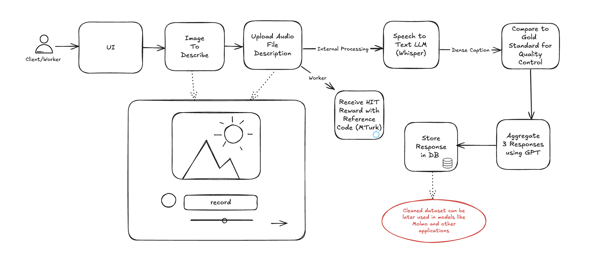

# DataLabeler
NETS 2130 final project

# Data Labeler: Dense Captioning Crowdsourcing Platform

**Data Labeler** is a platform designed for dense image captioning using crowdsourced audio descriptions. Users are presented with an image and asked to record an audio description for 60-90 seconds. The recorded audio is processed through Whisper for transcription, and the resulting caption undergoes quality evaluation using GPT. High-quality captions are aggregated and stored in a database for further use.

Upon successful submission of the audio description, the worker receives a unique completion code. This code can then be used by the worker to claim their reward on Amazon Mechanical Turk (MTurk), ensuring fair compensation for their efforts.

## Project Flow Diagram

## Major Components and Milestones

Below is a detailed explanation of the major components of the project, following the schematic in the flow diagram. Each component is assigned a point value (1-4) based on its complexity and the amount of work required.

### 1. **User Interface (UI) [2 points]**
   - Design a simple and intuitive interface where users can view an image and record their audio description.
   - Milestones:
     - Create a basic web UI for image display and audio recording.
     - Integrate a recording feature with a countdown timer (60-90 seconds).

### 2. **Image to Describe [1 point]**
   - Load and present the image to the user for description.
   - Milestones:
     - Set up an image retrieval system to fetch images from the dataset.
     - Ensure each image is only shown once per worker to avoid duplicates.

### 3. **Audio File Upload [2 points]**
   - Allow the user to upload their recorded audio file/re-record
   - Milestones:
     - Implement audio file handling and storage.
     - Validate the audio file format and length.

### 4. **Speech-to-Text (Whisper) [3 points]**
   - Use Whisper for converting the recorded audio into a text caption.
   - Milestones:
     - Integrate Whisper API for transcription.
     - Process and clean the transcribed text.

### 5. **Quality Control and Evaluation [4 points]**
   - Compare the transcribed caption against a gold standard for quality control using GPT.
   - Milestones:
     - Set up a quality control mechanism using test batches.
     - Integrate GPT for evaluating the caption’s accuracy and relevance.
     - Implement a feedback loop for workers who fail quality checks.

### 6. **Aggregation of High-Quality Responses [3 points]**
   - Aggregate three high-quality captions into a single final caption using GPT.
   - Milestones:
     - Collect responses and filter out low-quality submissions.
     - Use GPT to merge the responses into a coherent and accurate final caption.

### 7. **Database Storage [2 points]**
   - Store the aggregated caption and metadata in a database for future use.
   - Milestones:
     - Design the database schema for efficient storage and retrieval.
     - Implement the saving of captions and associated metadata (e.g., worker ID, image ID).

### 8. **Payment Code Generation and MTurk Integration [2 points]**
   - Generate a unique completion code for each worker upon successful submission.
   - Milestones:
     - Implement a code generation system and display the code to the user.
     - Integrate with Amazon Mechanical Turk (MTurk) for payment processing using the completion code.

## Total Point Value: **19 Points**
